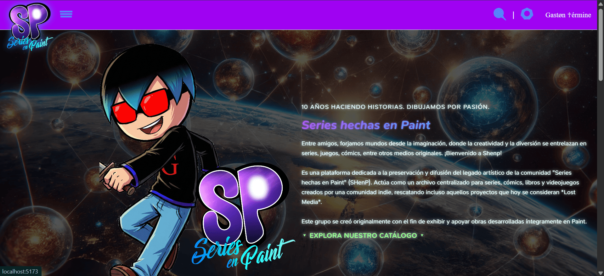
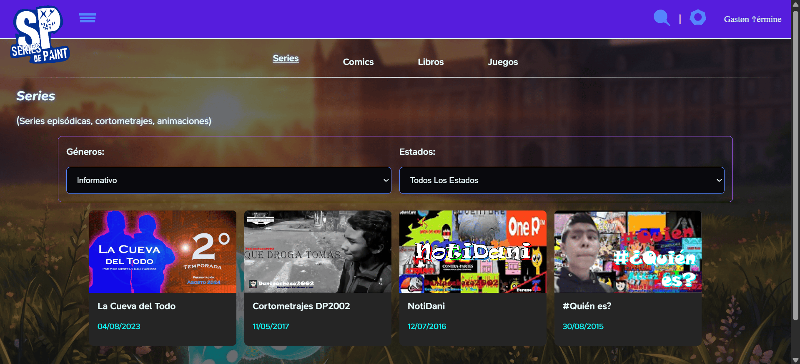
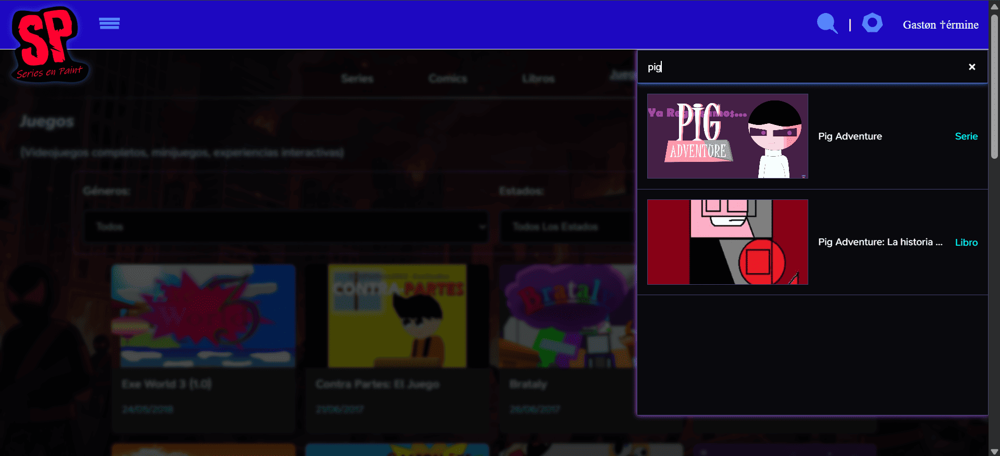
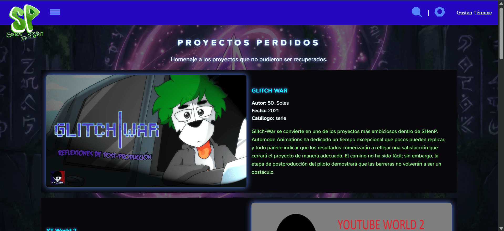
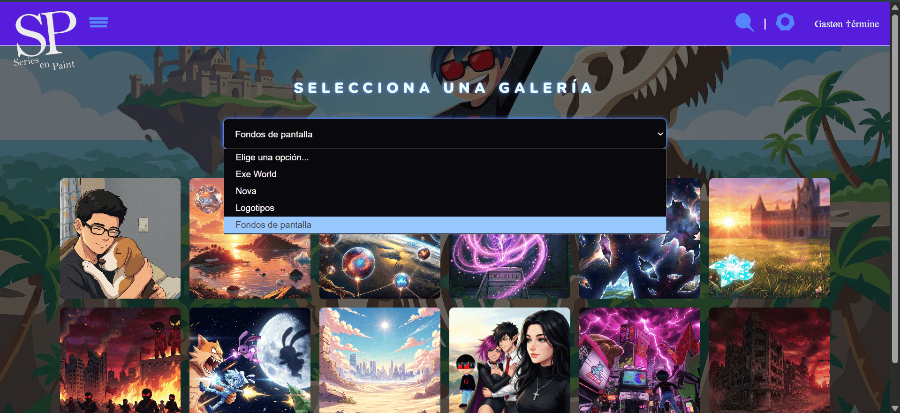
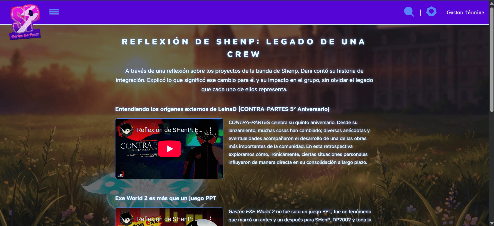
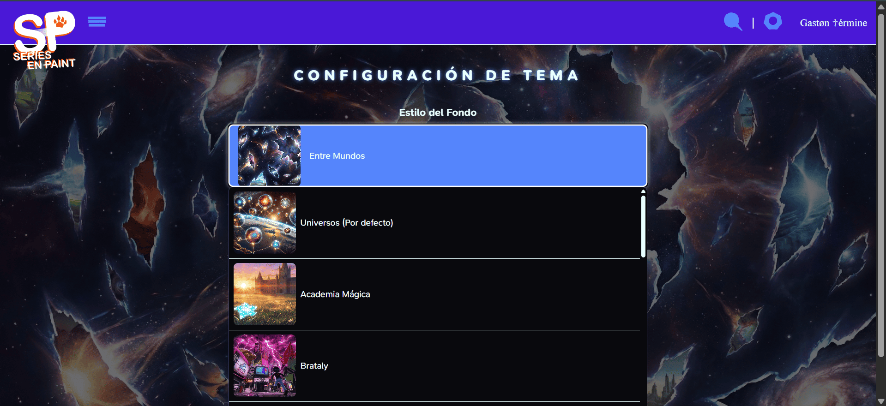

# Series hechas en Paint Web

**10 años haciendo historias. Dibujamos por pasión.**

**SHenP Web** es una plataforma dedicada a la preservación y difusión del legado artístico de la
comunidad "Series hechas en Paint" (SHenP).
Actúa como un archivo centralizado para series, cómics, libros y videojuegos creados por una comunidad indie,
rescatando incluso aquellos proyectos que hoy se consideran *Lost Media*.
Este grupo se creó originalmente con el fin de exhibir y apoyar obras desarrolladas íntegramente en Paint.

## Características Principales

* **Catálogo Multiformato:** Clasificación detallada de proyectos en Series, Cómics, Libros y Juegos para una navegación intuitiva.
* **Buscador Inteligente:** Sistema de búsqueda avanzada con previsualización dinámica de portadas y títulos en tiempo real.
* **Sección Lost Media:** Un archivo con estética técnica dedicado a la memoria y registro de proyectos no recuperados o fragmentados.
* **Personalización (UX/UI):** Panel de control para el usuario que permite cambiar fondos, ajustar la opacidad de lectura y alternar entre los distintos logotipos históricos de la comunidad.
* **Sistema de Filtros Avanzado:** 
    **Por Estado:** Visualización clara de obras (Finalizado, En Emisión, Lost Media, Cancelado).
    **Por Género:** Clasificación temática precisa (Terror, Suspenso, Entretenimiento, Acción, etc.).
* **Galería de Alta Resolución:** Espacio exclusivo con contenido visual oficial y material promocional disponible para descarga en máxima fidelidad.
* **Legado de Shenp:** Una sección dedicada a la reflexión sobre los orígenes, la evolución y la filosofía detrás del proyecto.

## Stack Tecnológico

* **Frontend:** HTML5 | React JS 
* **Estilos:** CSS / CSS Modules
* **SEO:** Optimización de Meta-tags para visibilidad en buscadores.
* **Gestión de Datos:** Firebase Firestore: Base de datos NoSQL para el almacenamiento del contenido recompilado y ordenado por Gastón Términe. 

## Estructura de Datos (Ficha Técnica)

Cada proyecto dentro de la plataforma se rige por una **Ficha Técnica Maestra** que garantiza la integridad de la información:

| Campo | Tipo | Descripción |
| --- | --- | --- |
| `idProyect` | `string` | **ID del Proyecto:** Título oficial e identificador único. |
| `projectNameSearch` | `string` | **Búsqueda:** Título optimizado para el motor de búsqueda. |
| `projectName` | `string` | **Nombre:** Título oficial mostrado en la interfaz. |
| `status` | `string` | **Estado:** Situación actual del proyecto. |
| `logoUrl` | `url` | **Logotipo:** Imagen del título en formato PNG transparente. |
| `coverArtUrl` | `url` | **Portada:** Imagen principal (Key Art) vertical u horizontal. |
| `introUrl` | `url` | **MiniPortada:** Imagen miniatura para previsualizaciones. |
| `description` | `string` | **Sinopsis:** Resumen detallado de la trama o mecánicas. |
| `authorName` | `string` | **Autor:** Nombre o Nick del creador original. |
| `authorProfileUrl` | `url` | **Perfil:** Enlace interno o redes sociales del autor. |
| `releaseDate` | `date` | **Fecha:** Día/Mes/Año o solo Año de lanzamiento. |
| `genre` | `array` | **Género:** Etiquetas de filtro (RPG, Terror, Acción, etc.). |
| `catalog` | `string` | **Catálogo:** Categoría (Juego, Serie, Cómic, etc.). |
| `gallery` | `array` | **Galería:** Lista de imágenes (Screenshots, arte, bocetos). |
| `projectUrl` | `url` | **Link:** Enlace de acceso/descarga (Oculto en `lostMedia`). |

### Estados (`status`)

Para mantener la coherencia visual, los estados se definen mediante la siguiente nomenclatura:

* 🟢 **`finalizado`**: El proyecto ha sido finalizado.
* 🔵 **`en-emisión`**: El proyecto se encuentra actualmente en desarrollo o emisión.
* ⚫ **`lost-media`**: Proyecto no disponible o paradero desconocido (el `projectUrl` se inhabilita).
* 🔴 **`cancelado`**: El desarrollo del proyecto ha sido detenido definitivamente.

## Mapa del Sitio

1. **Home (Landing Page):** El corazón del sitio. Presenta las últimas novedades, anuncios destacados y transmite el espíritu vibrante de la comunidad. Incluye el Buscador Inteligente, un sistema avanzado con previsualización dinámica de portadas y títulos en tiempo real para un acceso inmediato. 

2. **Catálogo Multiformato (Categorías):** Navegación intuitiva mediante una clasificación detallada. Permite explorar el contenido según su naturaleza: 
* **Series** (Animación, Live Action, etc.)
* **Cómics** (Novelas gráficas y tiras)
* **Libros** (Material escrito y lore)
* **Juegos** (Interactivos y fan-games)

3. **Buscador Inteligente:** Para una búsqueda de precisión, el usuario puede segmentar el catálogo bajo dos criterios principales: 
* **Por Estado** Visualización del estatus de la obra **(Finalizado, En Emisión, Lost Media, Cancelado)**.
* **Por Género** Clasificación temática (Terror, Suspenso, Entretenimiento, Acción, etc.).

4. **Sección Lost Media:** Un archivo con estética técnica y nostálgica dedicado a la memoria y registro de proyectos no recuperados, fragmentados o eliminados. Incluye descripciones breves sobre su origen y el estado actual de su búsqueda.

5. **Galería de Alta Resolución:** Espacio exclusivo dedicado al contenido visual oficial. Ofrece material promocional y arte conceptual disponible para descarga en máxima fidelidad (High-Res).

6. **Legado de Shenp (Reflexión):** Una sección narrativa y profunda dedicada a la reflexión sobre los orígenes, la evolución y la filosofía detrás del proyecto. Explora el "por qué" de la comunidad y su impacto a través del tiempo.

7. **Panel de Personalización (UX/UI):** Área de control donde el usuario toma el mando de su experiencia visual: 
* Cambio de fondos y temas.
* Ajuste de **opacidad de lectura** para mayor comodidad.
* Selector de **logotipos históricos**, permitiendo alternar la identidad visual del sitio según las distintas eras de la comunidad.

## Créditos

* **Desarrollo:** Gastøn ♱érmine - 2026
* **Comunidad:** Series hechas en Paint (SHENP).
* **Agradecimientos:** A todos los artistas que durante una década han forjado mundos desde la imaginación.

